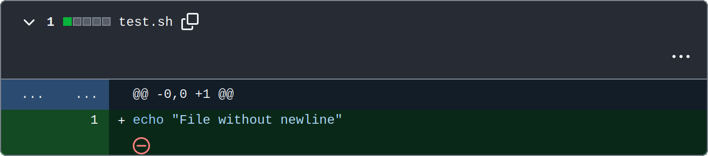

# check-final-newline

A linter checking if final newline is present in the repository text files.
It fails on errors reported by GitHub like this:



It runs on an alpine git image and uses standard Unix tools, therefore it's super fast:


## Usage

Create a workflow file at your repository's Workflow folder, like `.github/workflows/check-final-newline.yaml`:

```yaml
name: Check final newline

on:
  pull_request:
    branches: [main]

jobs:
  lint:
    runs-on: ubuntu-latest
    name: Check if all files end in newline
    steps:
      - name: Checkout
        uses: actions/checkout@v4

      - name: Check final newline
        uses: qwrtln/check-final-newline@v1.0.0
```

This will trigger a validation of all the text files in your repository.
